# Local Beans 
## T2A2 - Marketplace App
#### Kimberly McKenna

### R9 Website:
https://localbeans.herokuapp.com/

### R10 Github Repository:
https://github.com/kimckenna/localbeans/tree/main

## R7 The Problem

During the past year a lot have had to adapt to working from home on a more permanent basis and as a result their morning coffee ritual has transformed. Many have bought their own coffee machines and rather than buying a coffee each morning they’re looking for beans to brew at home. 

The intention of this app is to provide the means to search and reserve beans within your local area without having to visit every cafe to work out what’s on offer. 


## R8 How is Local Beans Solving the Problem?

Coffee is an Australian staple so there are plenty of options available but most places only stock one brand’s bean selection, so unless you have the time to independently search your local cafes and research online your options become somewhat limited. 

Having a variety to select from is not the only consideration; some people have a particular type or brand of bean they like and by having their local cafes stock in one place they have the added convenience of searching for that particular selection in one place. They’ll then be able to request their grind type which can be done on arrival to ensure freshness. 

An added bonus of this app is to support local businesses who may not have their own online presence to sell their coffee beans whilst inherently trying to reduce unnecessary logistical costs by having people shop within their local area or an area they frequent. 

## R11 About Local Beans

### PURPOSE

A coffee bean marketplace connecting cafes or bean stockists with those looking to brew their own coffee at home with a local stockist of their favourite beans.

### TARGET AUDIENCE

As a two way marketplace, Local Beans intended audience is coffee lovers or coffee machine owners looking to find beans from a variety of local stockists and cafes or bean stockists looking for a platform to list their beans without requiring the management of their own ecommerce website so they can focus on the primary aspect of their business. 

### FUNCTIONALITY AND FEATURES

**Implemented Features**

**User Accounts:**
- Visitors of the site are able to view all listings but in order to view a specific listing and reserve beans they must be logged in and have an account. Users can create an account inorder to reserve beans from a stockist on file.

**Stockist Accounts:**
- Users are able to become a Stockist by completing a second registration with their business details that is accessible through their user login details. 
- Stockists are able to add existing brands to their stockist account or create a new brand to use for their listings. 

**Bean Listings:**
- Users who are logged in are able to view the specific details of a listing and those who are not the owner of the listing can make a reservation. 
- A bean listing includes the ability for a user to select a particular size based on what the stockist has made available and a bean grind based on the preselected options the stockist has chosen.
- Only the listing stockist can edit and manage their listing. Due to time constraints at present the stockist only has the ability to make their listing inactive by making the sizes inactive, this way if a size is out of stock they can make the size inactive and still have the listing available for reservation via active sizes, if no sizes are active, the listing won't appear on the bean listing page.
- Stockists profiles hold all their listings including listings that are inactive. 
- A bean listing can be searched based on location from the home page.

**Reservations:** 
- Users are able to make a resrevation of a selected bean with the choice of grind and size. Once reserved they're presented with a reciept and the details of the stockist for collection. 
- Users are able to view all reservations they've made whilst stockists are able to view all reservations made to their listings. A user or stockist is only able to view a reservation if they've made it or it belongs to their listing. 

**Search Location**
- A very basic location search has been implemented. With more time this would have been further fleshed out with with additional features and implementation on the listings page as well as the home page. 
- Currently this is only accessible from the home page.

### SITE MAP

<p float="left" align="center">
  
</p>

### FINAL WEBSITE

#### Index Page

<p float="left" align="center">
  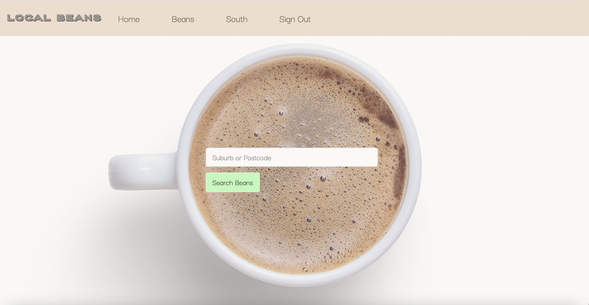
</p>

#### Listing Page

<p float="left" align="center">
  
</p>

#### Show Listing Page

<p float="left" align="center">
  
</p>

#### Reserve Page

<p float="left" align="center">
  
</p>

#### User Profile

<p float="left" align="center">
  
</p>

#### Business Profile

<p float="left" align="center">
  
</p>

#### New Listing - Brands

<p float="left" align="center">
  
</p>

#### New Listing - Edit

<p float="left" align="center">
  
</p>

### TECH STACK

**Front End**
- HTML
- CSS
- SCSS
- Bootstrap
- Javascript (from Rails)

**Back End**
- Ruby
- Ruby on Rails

**Database**
- PostgreSQL

**Deployment**
- Heroku

**Other Third Parties and Utilities**
- AWS S3 (v1.96)
- Devise Gem v4.8
- Simple Form Gem
- PG Search Gem
- Faker Gem v2.18 (for seeding)
- Rolify Gem v6.0 (not currently implemented)

## R12 User Stories

### Visitor
- As a visitor, I want to be able to view all bean listings 
- As a visitor, I want to be able to create an account 
- As a visitor, I want to be able to login to my new account

### User
- As a user, I want to be able to edit and update my details 
- As a user, I want to be able to change my password
- As a user, I want to be able to cancel my account
- As a user, I want to be able to view a specific listing 
- As a user, I want to be able to view an image of the product listing
- As a user, I want to be able to search beans based on location 
- As a user, I want to be able to see the brand of the beans 
- As a user, I want to be able to select my preferred grind type
- As a user, I want to be able to select an available size of beans to reserve
- As a user, I want to be able to see the price of the bean sizes
- As a user, I want to be able to reserve a listing 
- As a user, I want to be able to see confirmation of my reservation
- As a user, I want to be able to see my reservation price at time of reserving
- As a user, I want to be able to see all my reservations 
- As a user, I want to be able to become a stockist

**User Stories not yet achieved**
- As a user, I want to be able to see the stockist details prior to reserving
- As a user, I want to be able to search beans based on flavour profile
- As a user, I want to be able to purchase froma verified stockist 
- As a user, I want to be able to add an account image
- As a user, I want to be able to search my reservations
- As a user, I want to be able to save my preferred location
- As a user, I want to be able to reserve multiple bags of the selected coffee beans
- As a user, I want to be able to cancel a reservation

### Stockist
- As a stockist, I want to be able to edit my account
- As a stockist, I want to be able to create a listing 
- As a stockist, I want to be able to add an existing brand to my stockist account
- As a stockist, I want to be able to create a new brand if my brand doesn't exist
- As a stockist, I want to be able select the bean grinds I want my listing available in
- As a stockist, I want to be able to add additional sizes to my listing
- As a stockist, I want to be able to review all reservations made for my listings
- As a stockist, I want to be able to make a size inactive
- As a stockist, I want to be able to add an image of my product
- As a stockist, I want to be able to edit my listing

**Stockist Stories not yet achieved**
- As a stockist, I want to be able to have a stockist profile, users can visit and view all my available listings 
- As a stockist, I want to be able to search all my listing reservations based on item or date
- As a stockist, I want to be able to cancel a reservation
- As a stockist, I want the ability to remove a listing permenantly
- As a stockist, I want to be able to deactivate an entire listing in one go
- As a stockist, I want to be able to cancel my stockist profile

### Privacy: Authentication and Authorisation
- As a user or stockist, I do not want unauthorised users trying to access my details
- As a user or stockist, I do not want unauthorised users trying to access my reservervations
- As a stockist, I do not want unauthorised users being able to edit my listings
- As a stockist, I do not want users to have the ability to see inactive listings
- As a stockist, I do not want to be able to reserve my own listing
- As a user, I want to be able to access my account only when logged in

## R13 Wireframes

## R14 ERD

<p float="left" align="center">
  
</p>

## R15 Local Beans Abstractions


## R16 Third Party Services

**AWS S3** 
- The use of the AWS S3 will be implemented to to facilitate cloud storage for any images uploaded by the user, this currently includes stockist images for their profile or listings however the functionality displaying the stockist image has not yet been implemented.
- A view will render an image through a polymorphic table that makes a request to AWS for the required image. 

**Heroku**
- Heroku will be used as the cloud service hosting the website as it has free hosting options available and uses postgreSQL. 

**Bootstrap**
- Bootstrap will be used alongside custom css and scss to provide an efficient front-end design implementation.

### Primary Gems Utilised

**Devise**
- Devise will be used to handle user authentication. Through devise the user login, edit and delete MVC asnd functionality is provided. 
- The User model will be adapted slightly to include first_name and last_name and the views will be ammended to create uniformity with the websites other form displays. 
- Devise provides ```current_user``` which will be used throughout the app to ensure the correct displays are provided based on the user attempting to access them. 

**Simple Form**
- Simple Form will be used alonside Bootstrap to create simple clean design forms for any create, edit, destroy views or views that require user form input. 
- Simple Form will reduce the amount of code required by removing the need for labels and utilising the attribute name with the use of ```simple_form_for```.

**PG Search**
- PG Search will be used to implement a search function for listings. Initially this will be used to query the Address model ```:suburb``` and ```:postcode``` attributes and if time will allow for additional search capabilities within the Listing model. 

**Faker**
- The Faker gem is used to generate fake data during development, I'm keeping it in there for the purpose of this assessment, but in production I would ordinarily remove the seed data generating the user, stockist and listings that were developed for testing. 

## R17 Model Relationships: Active Record Associations

- A *user* ```has_one``` *stockist*
	- A *stockist* ```belongs_to``` one *user*

- A *user* ```has_many``` *reservations*
	- A *reservation* ```belongs_to``` one *user*

- A *stockist* ```has_many``` *addresses*	
	- An *address* ```belongs_to``` one *user*
	- ** the user currently only has the ability to add one address

- A *stockist* ```has_many``` *listings*
	- A *listing* ```belongs_to``` one *stockist*

- A *stockist* ```has_many``` *stockist_brands*
	- A *stockist* ```has_many``` *brands* ```through``` *stockist_brands* so a *brand* doesn't belong to a *stockist*

- A *stockist* ```has_one``` *image*
	- An *image* ```belongs_to``` a polymorphic table 

- An *address* ```has_many``` *listings* ```through``` *stockist*

- A *brand* ```has_many``` *listings*
	- A *listing* ```belongs_to``` one *brand*

- A *brand* ```has_many``` *stockist_brands*
	- A *brand* ```has_many``` *stockists* ```through``` *stockist_brands* so a *stockist* doesn't belong to a *brand*

- A *listing* ```has_many``` *sizes*
	- A *size* ```belongs_to``` one *listing*

- A *listing* ```has_many``` *listing_grinds*
	- A *listing* ```has_many``` *grinds* ```through``` *listing_grinds* so a *grind* doesn't belong to a *listing*

- A *listing* ```has_many``` *images*
	- An *image* ```belongs_to``` a polymorphic table
	- ** the listing currently only displays one image

- A *grind* ```has_many``` *listing_grinds*
	- A *grind* ```has_many``` *listings* ```through``` *listing_grinds* so a *listing* doesn't belong to a *grind*

- A *grind* ```has_many``` *reservations*
	- A *reservation* ```belongs_to``` one *grind*

- A *size* ```has_many``` *reservations*
	- A *reservation* ```belongs_to``` one *size*

```rb
	class User < ApplicationRecord
		has_one :stockist, dependent: :destroy
		has_many :reservations, dependent: :destroy

		accepts_nested_attributes_for :stockist
	end

	class Stockist < ApplicationRecord
		belongs_to :user
		has_many :addresses, dependent: :destroy
		has_many :listings, dependent: :destroy
		has_many :stockist_brands, dependent: :destroy
		has_many :brands, through: :stockist_brands, dependent: :destroy
		has_one :image

		accepts_nested_attributes_for :stockist_brands, :addresses
	end

	class Address < ApplicationRecord
		belongs_to :stockist
		has_many :listings, through: :stockist

		enum state: ['ACT', 'NSW', 'NT', 'QLD', 'SA', 'TAS', 'VIC', 'WA']
	end

	class StockistBrand < ApplicationRecord
		belongs_to :brand
		belongs_to :stockist
	end

	class Brand < ApplicationRecord
		has_many :listings, dependent: :destroy
		has_many :stockist_brands, dependent: :destroy
		has_many :stockists, through: :stockist_brands, dependent: :destroy

		accepts_nested_attributes_for :stockist_brands
	end

	class Listing < ApplicationRecord
		belongs_to :stockist
		belongs_to :brand
		has_many :sizes, dependent: :destroy
		has_many :listing_grinds, dependent: :destroy
		has_many :grinds, through: :listing_grinds, dependent: :destroy
		has_many_attached :images

		accepts_nested_attributes_for :brand, :sizes, :listing_grinds

		enum bean_type: ['Single Origin', 'Mix Blend', 'Decaf']
	end

	class ListingGrind < ApplicationRecord
		belongs_to :grind
		belongs_to :listing
	end

	class Grind < ApplicationRecord
		has_many :listing_grinds, dependent: :destroy
		has_many :listings, through: :listing_grinds, dependent: :destroy
		has_many :reservations, dependent: :destroy
	end

	class Size < ApplicationRecord
		belongs_to :listing
		has_many :reservations, dependent: :destroy
	end

	class Reservation < ApplicationRecord
		belongs_to :size
		belongs_to :user
		belongs_to :grind
	end
```
## R18 Database Relations

A relational database creates relations through a foreign key pointing to a primary key as a reference; as such the model holding the foreign key belongs to the model holding the primary key.

<p float="left" align="center">
  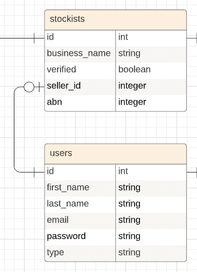
</p>

**User Stockist Relationship**
- A user can have one or zero stockists. 
- As a user creates a stockist account, so the stockist belongs to one and only one user. 

<p float="left" align="center">
  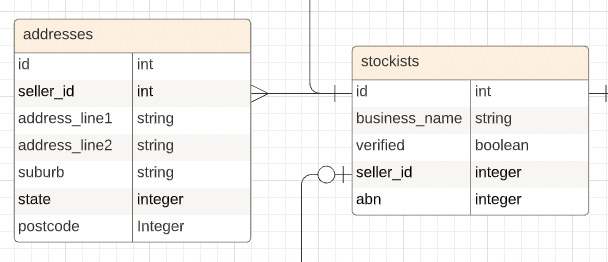
</p>

**Stockist Addresses Relationship**
- A stockist can have one or many addresses but must have at least one. 
- An address belongs to one and only one stockist.
- As this database is being implemented for Australia and a small project the address model has been intentionally normalised to this degree only.

<p float="left" align="center">
  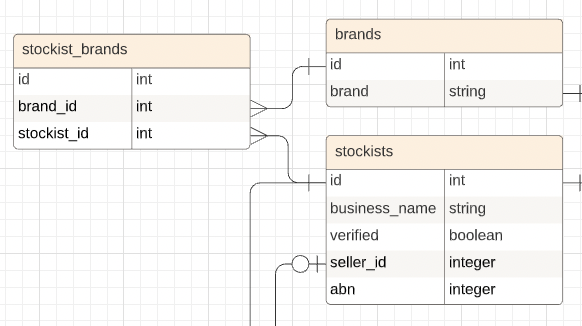
</p>

**Stockist Brands Relationship**
- To normalise the relationship between stockist and brands, a stockist can have no, one or many brands and a brand can have no, one or many stockists. 
- However as a listing must have a brand, a stockist can't have a listing without have a brand. 
- At the moment a brand will always have at least one stockist as I haven't implemented the ability to remove a brand from the stockist brands but in the furture a brand would have the ability to have no stockists and still exist.
- As this is a many to many relationship a join table stockist_brands was implemented where a brand or stockist can have many stockist_brands but a stockist_brands can only belong to one stockist and one brand. 

<p float="left" align="center">
  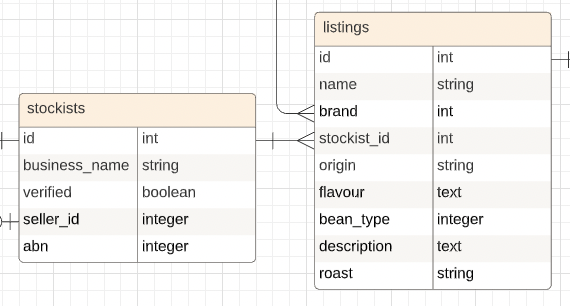
</p>

**Stockist Listings Relationship**
- A stockist can have no, one or many listings.
- A listing can have and only have one stockist.

<p float="left" align="center">
  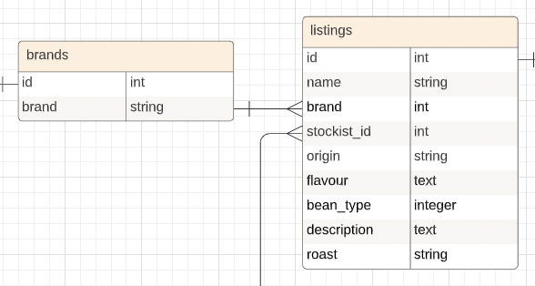
</p>

**Listing Brands Relationship**
- A brand can have many no, one or many listings.
- A listing must have one and only one brand.

<p float="left" align="center">
  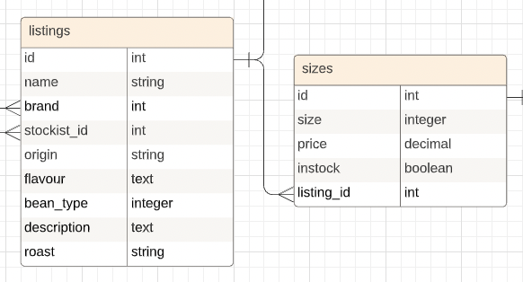
</p>

**Listing Sizes Relationship**
- A listing can have many sizes whereas a size can belong to one and only one listing. 
- This table could have potentially been further normalised, but I have left it to this point as the sizes model is also responsible for the price of a size and whether a size is active which determines whether a listing is active or not and with the expected size of the user database further noramlising this data would have likely made the relationship unnecessarily complicated. 

<p float="left" align="center">
  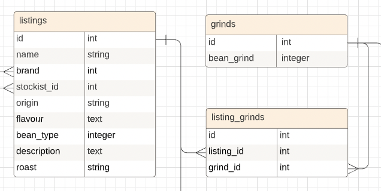
</p>

**Listing Grinds Relationship**
- A listing can have one or many grinds and a grind can belong to no, one or many listings.
- In order to keep the data normalised with a many to many relationship I have a listing_grinds table where a listing or grind can have many listing_grinds but a listing_grinds can only belong to one stockist and one brand. 

<p float="left" align="center">
  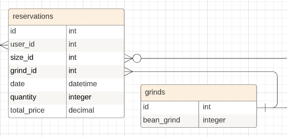
</p>

**Grinds Reservations Relationship**
- A grind can have no, one or many reservations.
- A reservation can have one and only one grind.

<p float="left" align="center">
  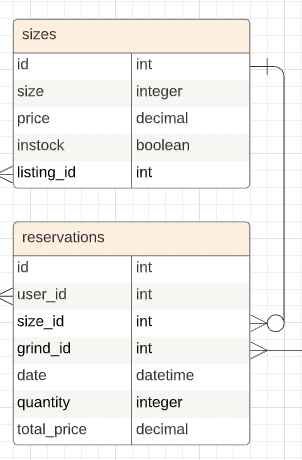
</p>

**Size Reservations Relationship**
- A size can have no, one or many reservations.
- A reservation must have one and only one size. 
- A reservation uses the size to model to determine the price at reservation. 

<p float="left" align="center">
  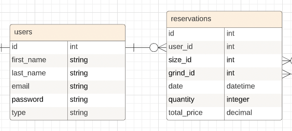
</p>

**User Reservations Relationship**
- A user can have no, one or many reservations. 
- A reservation can have and only have one user. 

## R19 Database Schema Design

As default all tables include a primary key id and: 
```
	created_at: datetime
	updated_at: datetime
```
All references, reference the attributes id as a foreign key for the model.

#### User

```
	first_name: string
	last_name: string
	email: string
	encrypted_password: string 
	reset_password_token: string
	reset_password_sent_at: datetime
	remember_created_at: datetime	
```

#### Stockist

```
	business_name: string
	abn: integer
	verified: boolean
	user: references 
```
*verified is included in schema but not currently being used due to time constraints -intention to have business verified if time allowed for admin implementation*

#### Address

```
	address_line1: string
	address_line2: string
	suburb: string
	state: integer
	postcode: integer
	stockist: references
```

#### StockistBrand

```
	stockist: references
	brand: references
```

#### Brand

```
	brand: string
```

#### Listing

```
	name: string
	origin: string 
	flavour_profile: text
	bean_type: integer
	description: text
	roast: string
	stockist: references
	brand: references
```

#### ListingGrind

```
	listing: references
	grind: references
```

#### Grind

```
	bean_grind: string
```

#### Size

```
	size: integer
	price: decimal
	active: boolean
```

#### Reservation

```
	quantity: integer
	total_price: decimal
	grind: references
	size: references
	user: references
```
*quantity is included in schema but not currently being used due to time constraints - intention to add quantity that could be reserved, am still using total_price to track price at time of purchase*

#### Active_Storage_Attachments

```
	name: string
	record_type: string
	record: references
	blob: references
```

#### Active_Storage_Blobs

```
	key: string
	filename: string
	content_type: string
	metadata: text
	byte_size: integer
	checksum: string
```

#### Roles

```
	name: string
	resource_type: string
	resource: references
```

*roles is included in schema but not currently being used due to time constraints - intention to add roles for user type and integrate admin*

#### Users_Roles

```
	user: references
	role: references
```

*user_roles is included in schema but not currently being used due to time constraints - intention to add roles for user type and integrate admin*

## D20 App Management and Task Allocation

#### Trello Board
https://trello.com/b/8gvpJLzF/local-beans

#### In Progress Screenshots

<p float="left" align="center">
  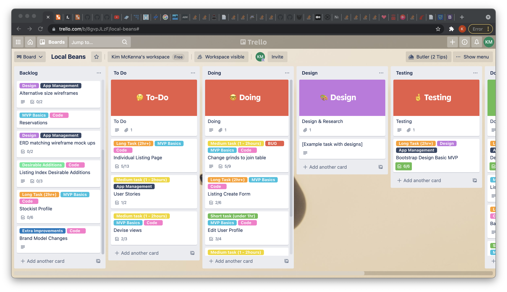
</p>

<p float="left" align="center">
  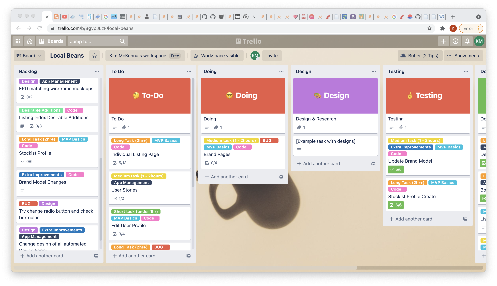
</p>

<p float="left" align="center">
  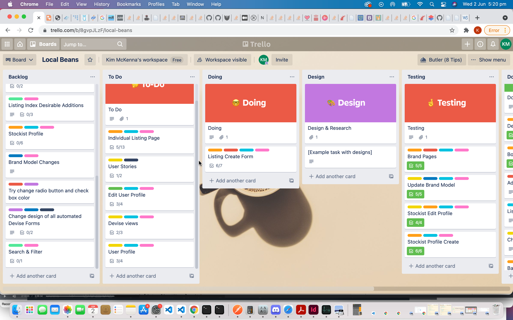
</p>

<p float="left" align="center">
  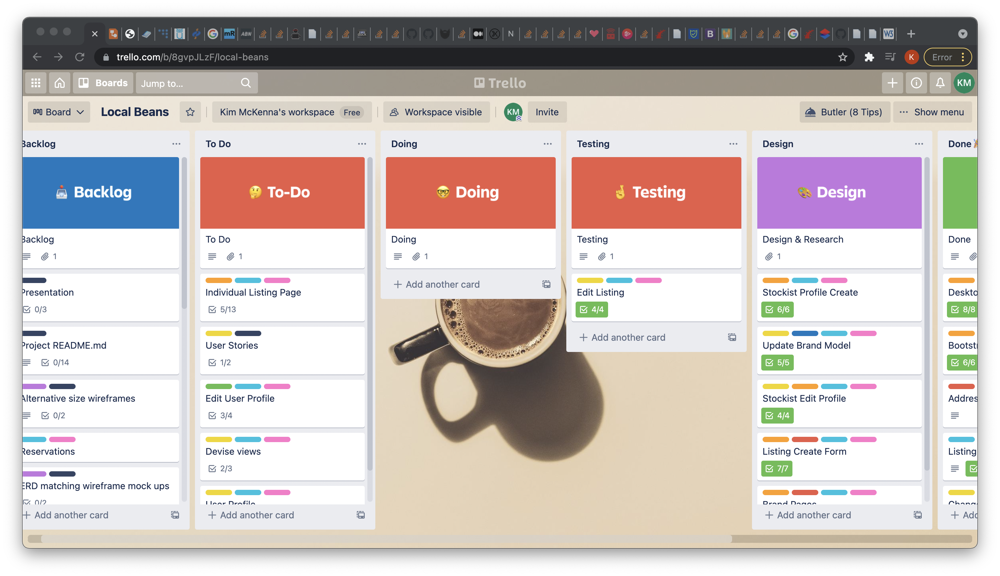
</p>

<p float="left" align="center">
  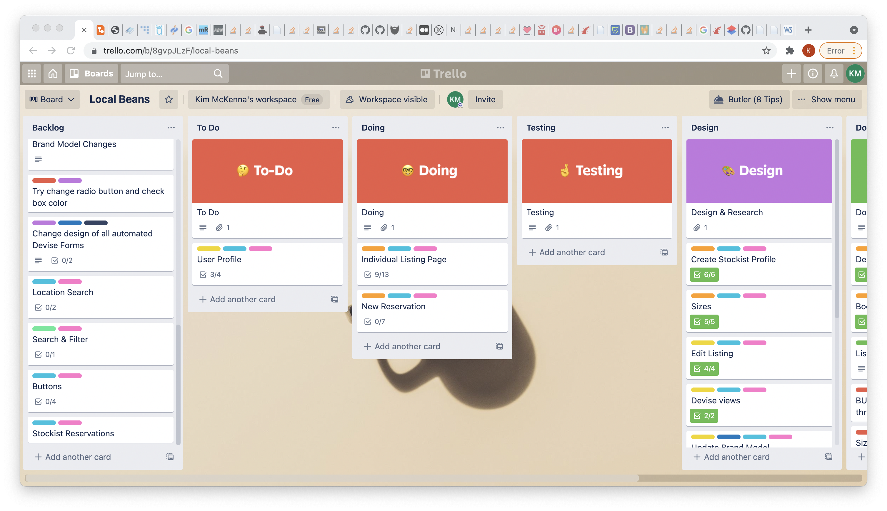
</p>

<p float="left" align="center">
  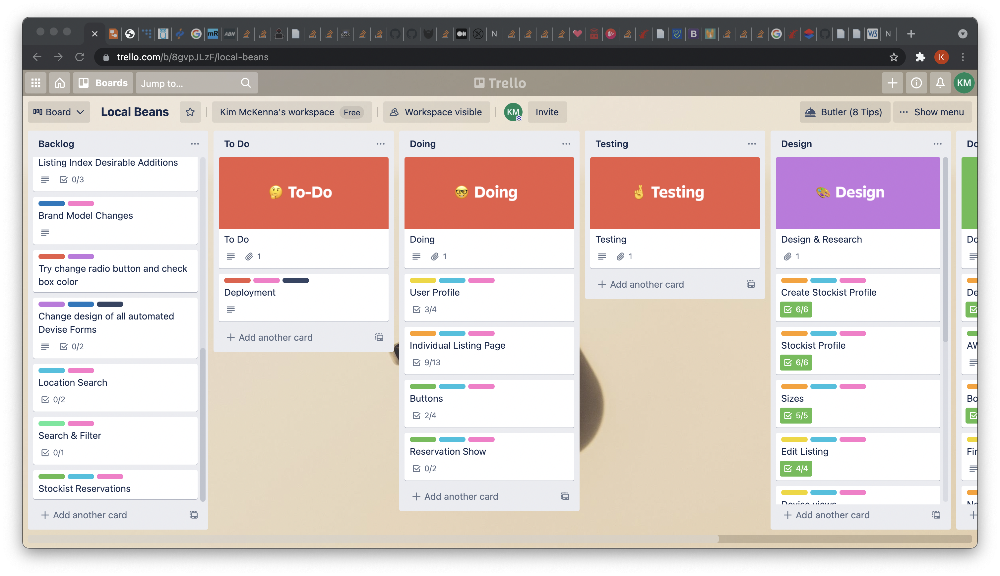
</p>

<p float="left" align="center">
  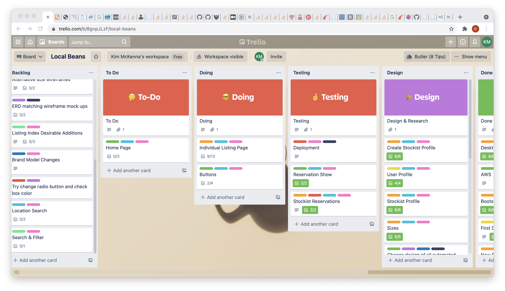
</p>

<p float="left" align="center">
  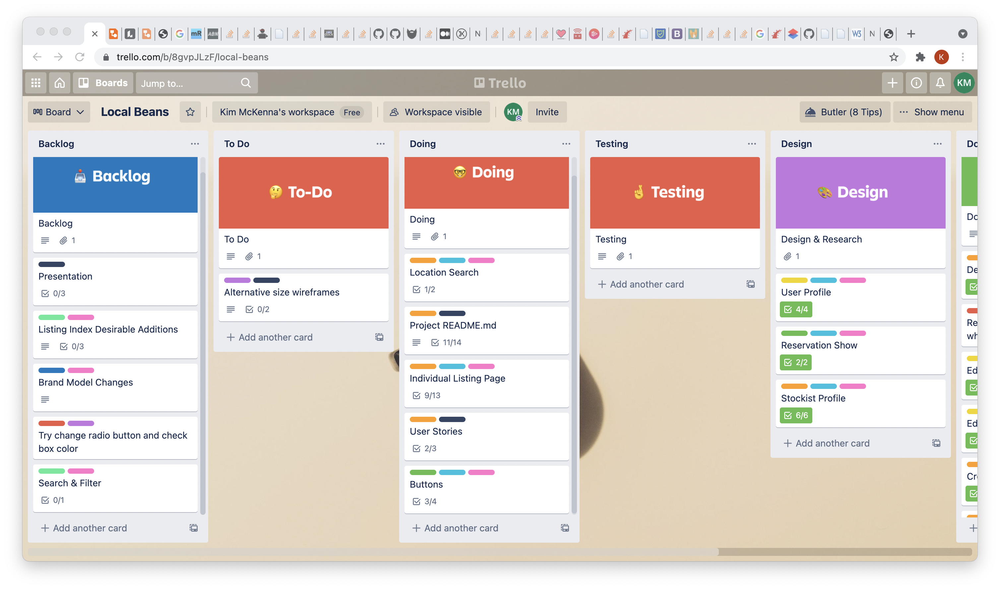
</p>
