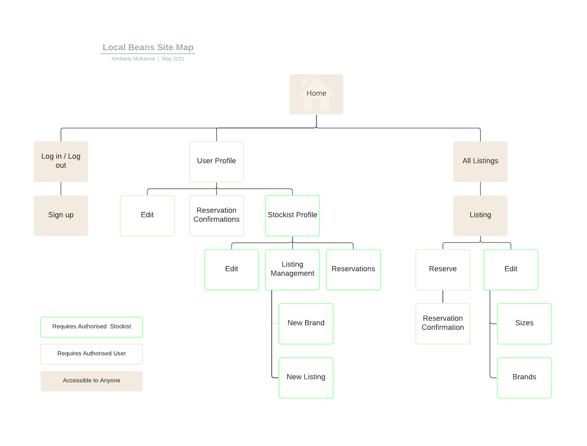
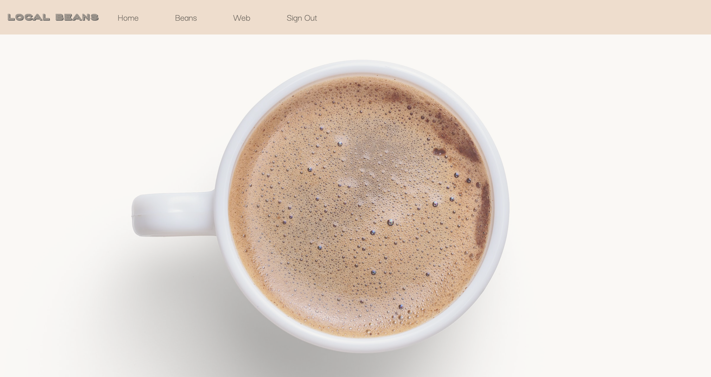
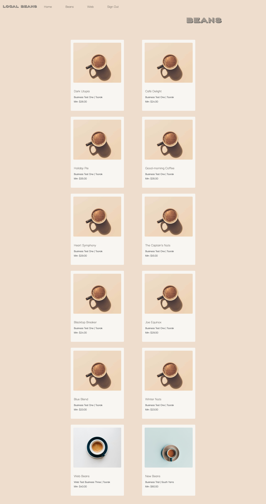
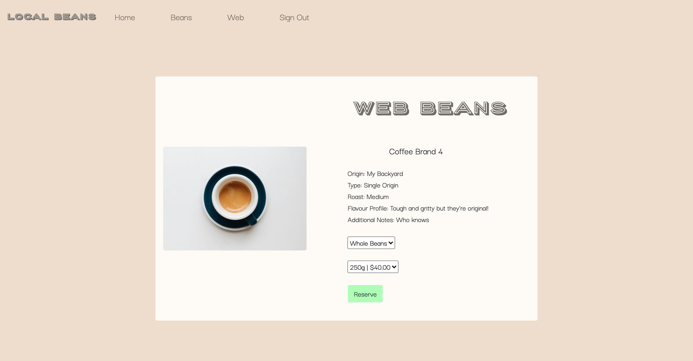
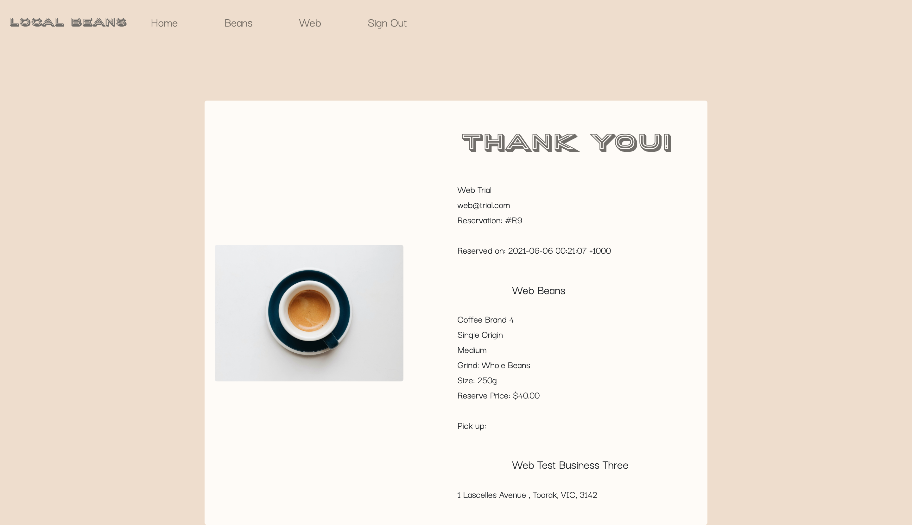
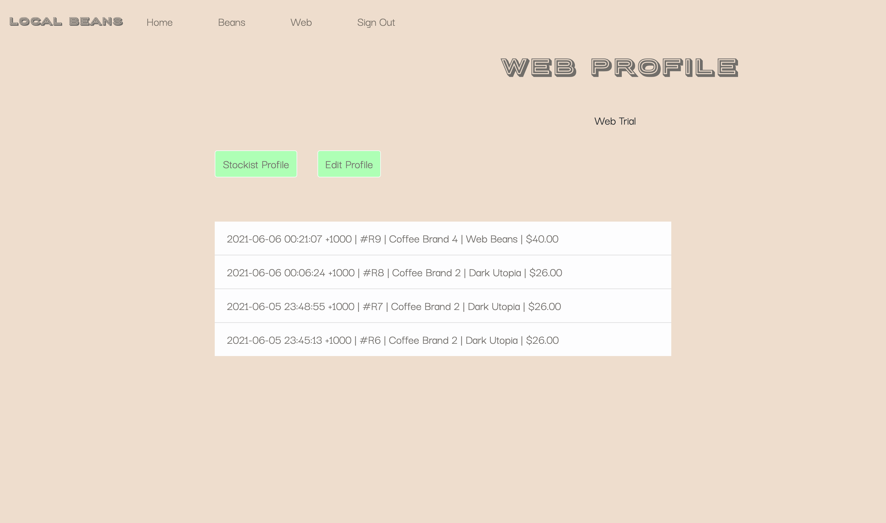
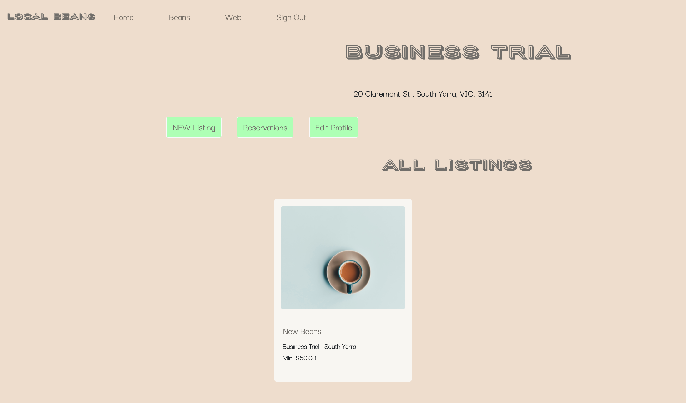
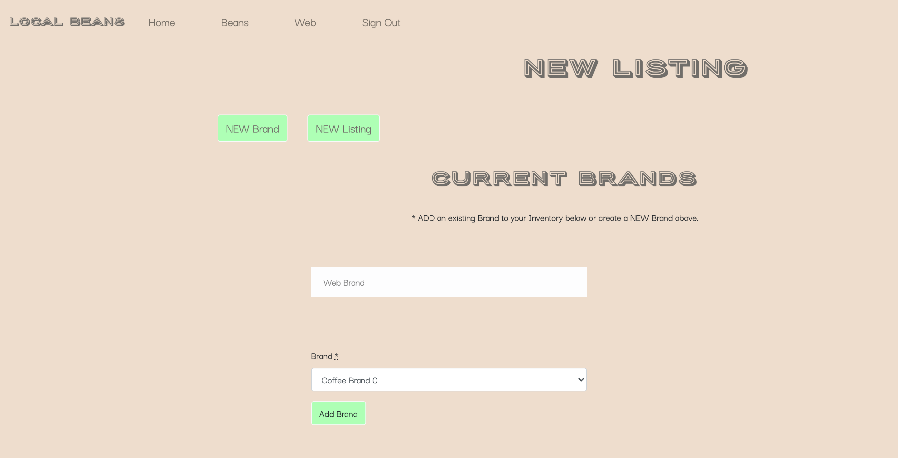
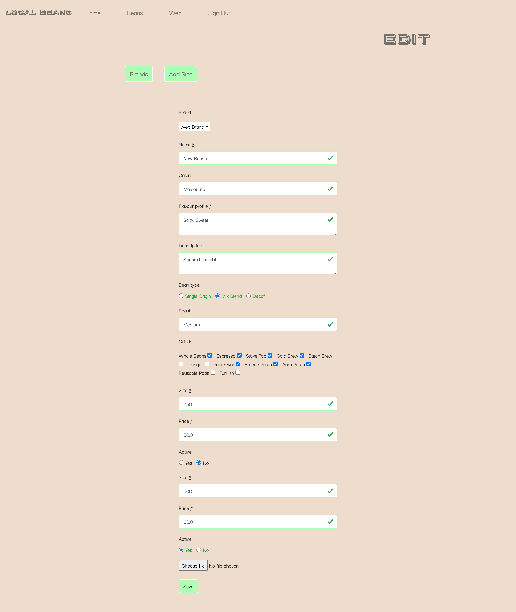
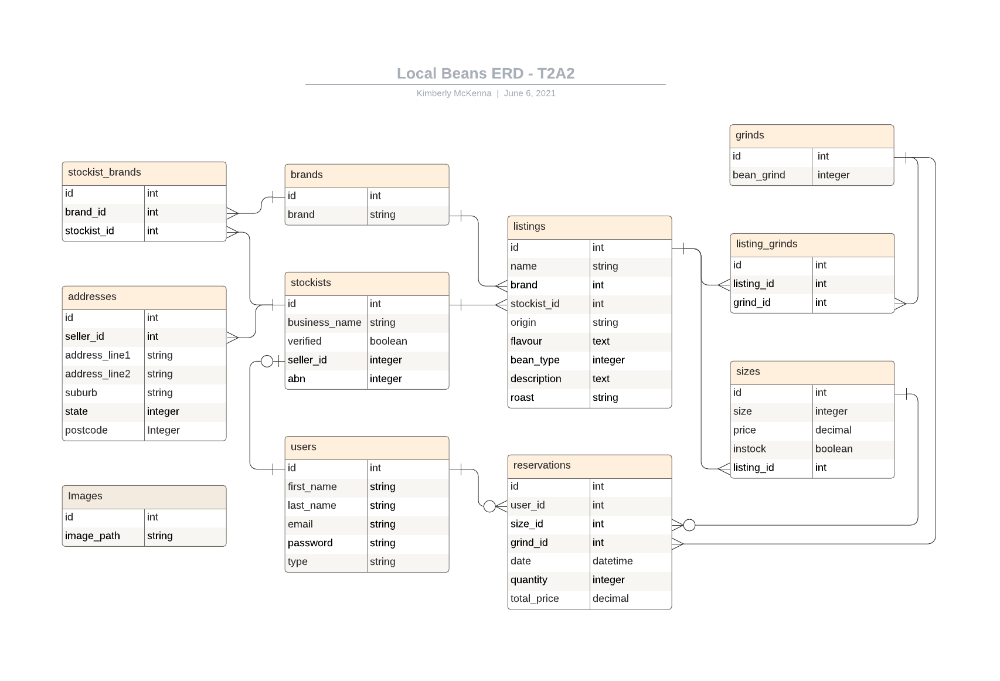

# Local Beans 
## T2A2 - Marketplace App
#### Kimberly McKenna

### R9 Website:
https://localbeans.herokuapp.com/

### R10 Github Repository:
https://github.com/kimckenna/localbeans/tree/main

## R7 The Problem

During the past year a lot have had to adapt to working from home on a more permanent basis and as a result their morning coffee ritual has transformed. Many have bought their own coffee machines and rather than buying a coffee each morning they’re looking for beans to brew at home. 

The intention of this app is to provide the means to search and reserve beans within your local area without having to visit every cafe to work out what’s on offer. 


## R8 How is Local Beans Solving the Problem?

Coffee is an Australian staple so there are plenty of options available but most places only stock one brand’s bean selection, so unless you have the time to independently search your local cafes and research online your options become somewhat limited. 

Having a variety to select from is not the only consideration; some people have a particular type or brand of bean they like and by having their local cafes stock in one place they have the added convenience of searching for that particular selection in one place. They’ll then be able to request their grind type which can be done on arrival to ensure freshness. 

An added bonus of this app is to support local businesses who may not have their own online presence to sell their coffee beans whilst inherently trying to reduce unnecessary logistical costs by having people shop within their local area or an area they frequent. 

## R11 About Local Beans

### PURPOSE

A coffee bean marketplace connecting cafes or bean stockists with those looking to brew their own coffee at home with a local stockist of their favourite beans.

### TARGET AUDIENCE

As a two way marketplace, Local Beans intended audience is coffee lovers or coffee machine owners looking to find beans from a variety of local stockists and cafes or bean stockists looking for a platform to list their beans without requiring the management of their own ecommerce website so they can focus on the primary aspect of their business. 

### FUNCTIONALITY AND FEATURES

**Implemented Features**

**User Accounts:**
- Visitors of the site are able to view all listings but in order to view a specific listing and reserve beans they must be logged in and have an account. Users can create an account inorder to reserve beans from a stockist on file.

**Stockist Accounts:**
- Users are able to become a Stockist by completing a second registration with their business details that is accessible through their user login details. 
- Stockists are able to add existing brands to their stockist account or create a new brand to use for their listings. 

**Bean Listings:**
- Users who are logged in are able to view the specific details of a listing and those who are not the owner of the listing can make a reservation. 
- A bean listing includes the ability for a user to select a particular size based on what the stockist has made available and a bean grind based on the preselected options the stockist has chosen.
- Only the listing stockist can edit and manage their listing. Due to time constraints at present the stockist only has the ability to make their listing inactive by making the sizes inactive, this way if a size is out of stock they can make the size inactive and still have the listing available for reservation via active sizes, if no sizes are active, the listing won't appear on the bean listing page.
- Stockists profiles hold all their listings including listings that are inactive. 

**Reservations:** 
- Users are able to make a resrevation of a selected bean with the choice of grind and size. Once reserved they're presented with a reciept and the details of the stockist for collection. 
- Users are able to view all reservations they've made whilst stockists are able to view all reservations made to their listings. A user or stockist is only able to view a reservation if they've made it or it belongs to their listing. 

### SITE MAP

<p float="left" align="center">
  
</p>

### FINAL WEBSITE

#### Index Page

<p float="left" align="center">
  
</p>

#### Listing Page

<p float="left" align="center">
  
</p>

#### Show Listing Page

<p float="left" align="center">
  
</p>

#### Reserve Page

<p float="left" align="center">
  
</p>

#### User Profile

<p float="left" align="center">
  
</p>

#### Business Profile

<p float="left" align="center">
  
</p>

#### New Listing - Brands

<p float="left" align="center">
  
</p>

#### New Listing - Edit

<p float="left" align="center">
  
</p>

### TECH STACK

**Front End**
- HTML
- CSS
- SCSS
- Bootstrap
- Javascript (from Rails)

**Back End**
- Ruby
- Ruby on Rails

**Database**
- PostgreSQL

**Deployment**
- Heroku

**Third Parties and Utilities**
- AWS S3 (v1.96)
- Devise Gem v4.8
- Simple Form Gem
- Faker Gem v2.18 (for seeding)
- Rolify Gem v6.0 (not currently implemented)

## R12 User Stories

## R13 Wireframes

## R14 ERD

<p float="left" align="center">
  
</p>

## R15 Local Beans Abstractions

## R16 Third Party Services

## R17 Model Relationships: Active Record Associations

```rb
	class User < ApplicationRecord
		has_one :stockist, dependent: :destroy
		has_many :reservations, dependent: :destroy

		accepts_nested_attributes_for :stockist
	end

	class Stockist < ApplicationRecord
		belongs_to :user
		has_many :addresses, dependent: :destroy
		has_many :listings, dependent: :destroy
		has_many :stockist_brands, dependent: :destroy
		has_many :brands, through: :stockist_brands, dependent: :destroy
		has_one :image

		accepts_nested_attributes_for :stockist_brands, :addresses
	end

	class Address < ApplicationRecord
		belongs_to :stockist
		has_many :listings, through: :stockist

		enum state: ['ACT', 'NSW', 'NT', 'QLD', 'SA', 'TAS', 'VIC', 'WA']
	end

	class StockistBrand < ApplicationRecord
		belongs_to :brand
		belongs_to :stockist
	end

	class Brand < ApplicationRecord
		has_many :listings, dependent: :destroy
		has_many :stockist_brands, dependent: :destroy
		has_many :stockists, through: :stockist_brands, dependent: :destroy

		accepts_nested_attributes_for :stockist_brands
	end

	class Listing < ApplicationRecord
		belongs_to :stockist
		belongs_to :brand
		has_many :sizes, dependent: :destroy
		has_many :listing_grinds, dependent: :destroy
		has_many :grinds, through: :listing_grinds, dependent: :destroy
		has_many_attached :images

		accepts_nested_attributes_for :brand, :sizes, :listing_grinds

		enum bean_type: ['Single Origin', 'Mix Blend', 'Decaf']
	end

	class ListingGrind < ApplicationRecord
		belongs_to :grind
		belongs_to :listing
	end

	class Grind < ApplicationRecord
		has_many :listing_grinds, dependent: :destroy
		has_many :listings, through: :listing_grinds, dependent: :destroy
		has_many :reservations, dependent: :destroy
	end

	class Size < ApplicationRecord
		belongs_to :listing
		has_many :reservations, dependent: :destroy
	end

	class Reservation < ApplicationRecord
		belongs_to :size
		belongs_to :user
		belongs_to :grind
	end
```
## R18 Database Relations

## R19 Database Schema Design

As default all tables include a primary key id and: 
```
	created_at: datetime
	updated_at: datetime
```
All references, reference the attributes id as a foreign key for the model.

#### User

```
	first_name: string
	last_name: string
	email: string
	encrypted_password: string 
	reset_password_token: string
	reset_password_sent_at: datetime
	remember_created_at: datetime	
```

#### Stockist

```
	business_name: string
	abn: integer
	verified: boolean
	user: references 
```
*verified is included in schema but not currently being used due to time constraints -intention to have business verified if time allowed for admin implementation*

#### Address

```
	address_line1: string
	address_line2: string
	suburb: string
	state: integer
	postcode: integer
	stockist: references
```

#### StockistBrand

```
	stockist: references
	brand: references
```

#### Brand

```
	brand: string
```

#### Listing

```
	name: string
	origin: string 
	flavour_profile: text
	bean_type: integer
	description: text
	roast: string
	stockist: references
	brand: references
```

#### ListingGrind

```
	listing: references
	grind: references
```

#### Grind

```
	bean_grind: string
```

#### Size

```
	size: integer
	price: decimal
	active: boolean
```

#### Reservation

```
	quantity: integer
	total_price: decimal
	grind: references
	size: references
	user: references
```
*quantity & total_price are included in schema but not currently being used due to time constraints - intention to add quantity that could be reserved*

#### Active_Storage_Attachments

```
	name: string
	record_type: string
	record: references
	blob: references
```

#### Active_Storage_Blobs

```
	key: string
	filename: string
	content_type: string
	metadata: text
	byte_size: integer
	checksum: string
```

#### Roles

```
	name: string
	resource_type: string
	resource: references
```

*roles is included in schema but not currently being used due to time constraints - intention to add roles for user type and integrate admin*

#### Users_Roles

```
	user: references
	role: references
```

*user_roles is included in schema but not currently being used due to time constraints - intention to add roles for user type and integrate admin*

## D20 App Management and Task Allocation